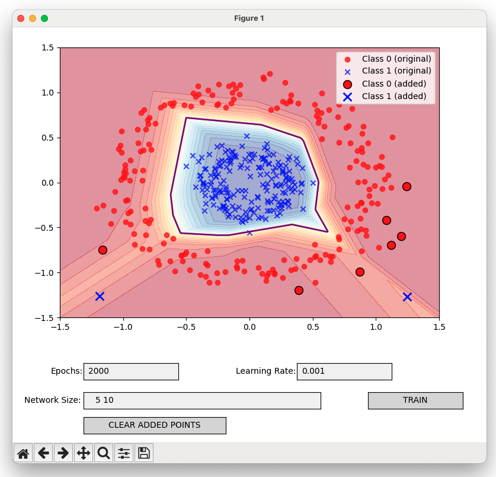

# Network-Starterpack
##Lecture-3

In this lecture we build a MLP and train it over many scikit-learn datasets.

## Play with the demos here:
## [Online demo!](https://colab.research.google.com/drive/1zpdQuBRg5l5rmY5X_2CPzP-HxZWoLt_j?usp=sharing)

--- 

## How to run it locally:

1. Install Python 3.8 or higher

2. Install the required packages:
```
pip install -r requirements.txt
```

3. Run the script:
```
python visuals/circles.py

# or for windows:

python visuals\circles.py
```

Choose from the available datasets in the `visuals` folder:
- `circles.py`
- `moons.py`
- `blobs.py`
- `checkerboard.py`
- `multiclass.py`
- `biclusters.py`
- `lines.py`

4. Enjoy the visualizations!


